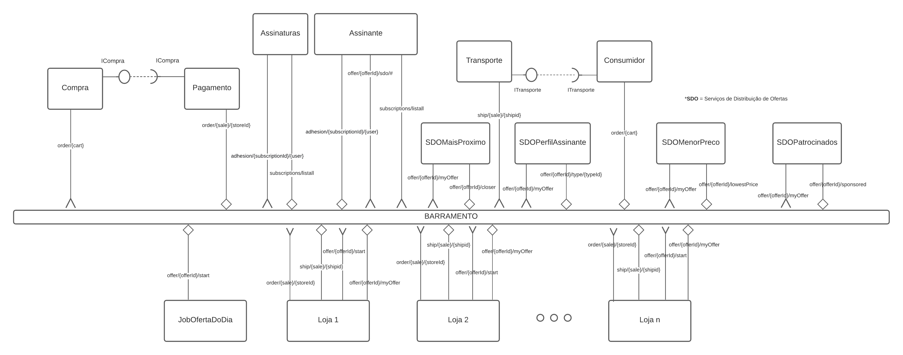
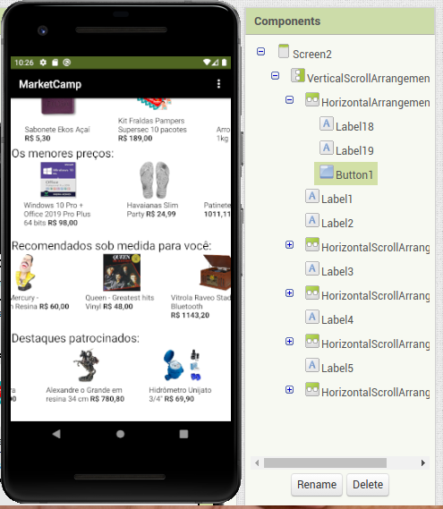
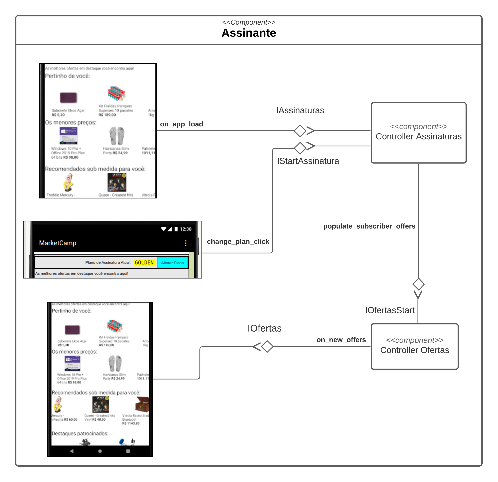

# Projeto `MarketCamp`

# Equipe

* Carlos Nihelton Santana de Oliveira
* Leonardo Martins de Oliveira
* Paulo Gabriel S.A. Carvalho
* Paulo Sérgio do Nascimento

# Nível 1

> Apresente aqui o detalhamento do Nível 1 conforme detalhado na especificação com, no mínimo, as seguintes subseções:

## Diagrama Geral do Nível 1

### Detalhamento da interação de componentes

* O componente `JobOfertaDoDia` periodicamente dispara uma mensagem de tópico "`offer/{offerId}/start`" através da interface `OfferStart`, iniciando a
  coreografia das ofertas.
* As lojas assinam o tópico "`offer/+/start`" e reagem a ele emitindo mensagens de ofertas exclusivas, de tópico "`offer/{offerId}/myOffer`", contendo dados da
  loja, produtos e preços ofertados através da interface `SendOffer`.
  
* Diversos Serviços de Distribuição de Ofertas (SDO) se conectam ao barramento, assinando mensagens de tópico "`offer/+/myOffer`" e realizando processamentos
  específicos sobre elas, finalmente selecionando quais ofertas serão enviadas ao assinante, através da interface `OfferDistService`.
* As ofertas filtradas pelos SDO são emitidas no barramento na forma de tópicos "`offer/{offerId}/sdo/#`", em que o *wildcard* representa uma das terminações de
  tópico específicas para os diferentes tipos de SDO existentes (no momento deste relatório existem os serviços: `closer`, `type/{typeId}`, `lowestPrice`, `sponsored`).

* O componente `Assinante` escuta a mensagem no tópico `subscriptions/listall` emitido por `Assinatura` para obter a lista de tipos de assinaturas disponíveis para apreciação.
* O componente `Assinante` envia mensagem no tópico `adhesion/{subscriptionId/{user}` para se cadastrar em um plano de assinatura que por sua vez é escutado pelo componente `Assinatura`.
* O componente `Assinante` escuta mensagens no tópico `offer/{offerId}/sdo/closer` emitido pelo componente `SDOMaisProximo` para obter ofertas mais próximas.
* O componente `Assinante` escuta mensagens no tópico `offer/{offerId}/sdo/type/{typeId}` emitido pelo componente `SDOPerfilAssinante` para obter ofertas personalizadas de acordo com o gosto pessoal.
* O componente `Assinante` escuta mensagens no tópico `offer/{offerId}/sdo/lowestPrice` emitido pelo componente `SDOMenorPreco` para obter as ofertas dos produtos com menores preços.
* O componente `Assinante` escuta mensagens no tópico `offer/{offerId}/sdo/sponsored` emitido pelo componente `SDOPatrocinados` para obter as ofertas de produtos patrocinados.
* O componente `Consumidor` envia a mensagem no tópico `order/{cart}` para que seja realizado a compra do produto escolhido pelo cliente.
* O componente `Compra` escuta a mensagem no tópico `order/{cart}` emitido por `Consumidor` e então realiza a comunicação com o pagamento. O componente `Compra` provém para o pagamento a interface `ICompra`.
* O componente `Pagamento` por requerer uma interface `ICompra`, ao obtê-la realiza todos os processamentos necessários com o carrinho de compras do consumidor.
* O Pagamento então dispara, com o pedido feito, dispara uma mensagem no tópico `order/{sale}/{storeid}` contendo as informações da venda e o id da loja.
* O componente de lojas escutam o tópico `order/{sale}/{sotreId}` e obtém os dados da venda realizada para o cliente.
* A loja então, emite uma mensagem no tópico `ship/{sale}/{shipid}`.
* O componente `Transporte` recebe a mensagem presente no tópico `ship/{sale}/{shipid}` e então a processa, para que então o componente do Consumidor possa requerer os dados do transporte através da interface
  `ITransporte`

> Para cada componente será apresentado um documento conforme o modelo a seguir:

## Componente `<Nome do Componente>`

> Resumo do papel do componente e serviços que ele oferece.

> Diagrama do componente, conforme exemplo a seguir:

**Interfaces**
> Listagem das interfaces do componente.

As interfaces listadas são detalhadas a seguir:

## Detalhamento das Interfaces

### Interface `<nome da interface>`

> Resumo do papel da interface.

> Dados da interface podem ser apresentados em formato texto, conforme exemplo:

* Type: `sink`
* Topic: `pedido/+/entrega`
* Message type: `Order`

> Ou em formato de imagem, conforme exemplo:

> Diagrama representando o esquema das mensagens JSON utilizadas na interface, pode ser em formato texto conforme exemplo:

~~~json
{
  orderId: string,
  dueDate: date,
  total: number,
  items: [
    {
         itemid: string,
         quantity: number
    }
  ]  
}
~~~

> Ou em formato de imagem, conforme exemplo:

# Nível 2

> Apresente aqui o detalhamento do Nível 2 conforme detalhado na especificação com, no mínimo, as seguintes subseções:

## Diagrama do Nível 2

> Apresente um diagrama conforme o modelo a seguir:

> 

### Detalhamento da interação de componentes

> O detalhamento deve seguir um formato de acordo com o exemplo a seguir:

* O componente `Entrega Pedido Compra` assina no barramento mensagens de tópico "`pedido/+/entrega`" através da interface `Solicita Entrega`.
  * Ao receber uma mensagem de tópico "`pedido/+/entrega`", dispara o início da entrega de um conjunto de produtos.
* Os componentes `Solicita Estoque` e `Solicita Compra` se comunicam com componentes externos pelo barramento:
  * Para consultar o estoque, o componente `Solicita Estoque` publica no barramento uma mensagem de tópico "`produto/<id>/estoque/consulta`" através da interface `Consulta Estoque` e assina mensagens de tópico "`produto/<id>/estoque/status`" através da interface `Posição Estoque` que retorna a disponibilidade do produto.

> Para cada componente será apresentado um documento conforme o modelo a seguir:

## Componente `<Nome do Componente>`

> Resumo do papel do componente e serviços que ele oferece.

**Interfaces**
> Listagem das interfaces do componente.

As interfaces listadas são detalhadas a seguir:

## Detalhamento das Interfaces

### Interface `<nome da interface>`

> Resumo do papel da interface.

Método | Objetivo
-------| --------
`<id do método>` | `<objetivo do método e descrição dos parâmetros>`

## Exemplos:

### Interface `ITableProducer`

Interface provida por qualquer fonte de dados que os forneça na forma de uma tabela.

Método | Objetivo
-------| --------
`requestAttributes` | Retorna um vetor com o nome de todos os atributos (colunas) da tabela.
`requestInstances` | Retorna uma matriz em que cada linha representa uma instância e cada coluna o valor do respectivo atributo (a ordem dos atributos é a mesma daquela fornecida por `requestAttributes`.

### Interface `IDataSetProperties`

Define o recurso (usualmente o caminho para um arquivo em disco) que é a fonte de dados.

Método | Objetivo
-------| --------
`getDataSource` | Retorna o caminho da fonte de dados.
`setDataSource` | Define o caminho da fonte de dados, informado através do parâmetro `dataSource`.

## Diagrama do Nível 3

> Apresente uma imagem com a captura de tela de seu protótipo feito no MIT App Inventor, conforme modelo a seguir:

> Apresente o diagrama referente ao protótipo conforme o modelo a seguir:

### Detalhamento da interação de componentes

> O detalhamento deve seguir o mesmo formato usado no Nível 2.
